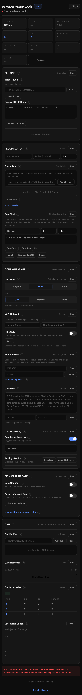

# Dashboard Guide

[Project Home](../) | [Documentation](index.md) | [Build & Flash](building.md) | [Plugin System](plugins.md) | [Release Notes](../CHANGELOG.md)

The dashboard is available on ESP32 builds that include `ESP32_DASHBOARD`. It runs from the device itself and is intended for local management at `http://100.100.1.1/` while connected to the device hotspot.

## Core Runtime Controls

- **Hardware**: switch the active runtime mode between `Legacy`, `HW3`, and `HW4`
- **Speed Profile**: follow the stalk automatically or lock a manual profile; HW4 adds `Max` and `Sloth`
- **Features**: only `Enable Logging` remains on the main card; the other vehicle overrides are no longer exposed there
- **Injection control**: stop or resume CAN injection without reflashing, then reboot from the UI when needed

## CAN Tools

- **CAN Sniffer**: live frame view with filtering by ID or known frame name
- **Wire / DBC ID toggle**: switch between on-wire 11-bit IDs and prefixed DBC-style IDs
- **CAN Recorder**: capture up to 2000 frames and export them as CSV
- **CAN Controller**: inspect per-mux RX/TX/error counters and controller error flags
- **Live Log**: view firmware log output directly in the dashboard

## Connectivity And Updates

- **WiFi Hotspot**: change AP name and password, optionally hide the SSID, and keep the values across reboots and firmware updates
- **WiFi Internet**: scan for networks, connect as STA, and optionally store a static IP/gateway/mask/DNS configuration
- **Firmware Update**: check GitHub releases, switch between stable and beta channel, enable auto-update on boot, or upload a local `.bin` manually
- **CAN Pins**: override TWAI TX/RX GPIO pins at runtime for supported boards; settings are stored in NVS
- **Settings Backup**: export and restore AP, WiFi, CAN pin, update, and plugin replay settings as JSON

## Plugins

- **Plugins card**: install from URL, upload a `.json`, or paste JSON directly when offline
- **Plugin list**: inspect rules, enable or disable plugins, remove them, and spot priority overlaps between enabled plugins
- **Plugin Editor**: create plugins without hand-writing JSON, preview the result live, load an installed plugin back into the editor, download the generated file, and add a quick rule from shorthand such as `0x7FF mux=2 byte[5] = 0x4C`
- **Rule Test**: wait for a matching live CAN frame, apply one editor rule to that frame, then send the result repeatedly with a chosen count and interval
- **Plugin Replay**: set how many modified GTW 2047 (`0x7FF`) plugin frames are sent for each observed GTW frame
- **Periodic emit plugins**: use `emit_periodic` rules to keep the last modified GTW mux 3 value on the bus, optionally with GTW UDS silent-mode keep-alives
- Plugin-based overrides such as nag suppression and Summon unlock can live here instead of on the main Features card
- Dashboard builds only inject automatically through enabled plugins; built-in vehicle handlers stay observational
- Dashboard cards can be collapsed individually with `Hide` / `Show` to keep the page shorter on mobile

## Persistence Notes

- WiFi hotspot settings, WiFi internet settings, update flags, CAN pins, and several runtime defaults are stored in NVS
- Installed plugins live on SPIFFS, start disabled after install, and restore their enabled or disabled state on boot
- On AtomS3 Mini builds, the built-in button can toggle injection and that state is also persisted
